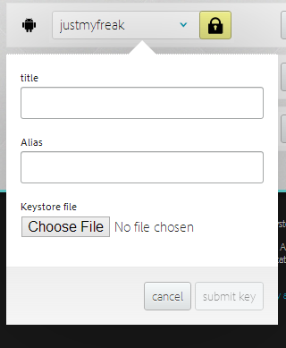

# Step by Step
In 5 easy steps, you can use PhonGgap Build and get it set up.

## Prepare Development Environment
Before using PhoneGap Build service, you will need to check that you have all of the required elements, as listed below:

- PC or Mac. This is needed to get certificate for signing application.
- Text editor : Preferably with xml highlighting  such as Notepad++ or Sublime Text. You will need this to write `config.xml`.
- Register apple developer program. You will need to enroll on it if you plan to build for iOS devices.
- Google Chrome or other browser. need web browser to use PhoneGap Build.
- GitHub account. You will need it if you want to deploy via Git

## Import Signing Keys
Importing signing keys is very important especially if you plan to deploy and publish application on iOS, Android, and Blackberry. For testing purpose, Android and Blackberry require no sign key. But for iOS, you will need to have signing for both development and publishing application.

For Android signing, we first need to generate a signing `keystore` file. Full details are available in [http://developer.android.com/guide/publishing/app-signing.html](http://developer.android.com/guide/publishing/app-signing.html). Please record `alias` as well as `keystore password` and `key password` that you set for your `keystore`. Then go to your account, click add key,  and fill all your details.

For Blackberry signing, we first need to register on RIM’s site at [https://www.blackberry.com/SignedKeys/](https://www.blackberry.com/SignedKeys/) ,then follow the installation process. Once installed, we must find SDK directory when we installed key.

	C:\SDK_PATH\bin\sigtool.csk
	C:\SDK_PATH\bin\sigtool.db
	
Both files are required to sign and build Blackberry application. `signtool.csk` contain database private key and salt and `sigtool.db` contain credentials for connecting on RIM’s server. Then we need to add both file in BlackBerry  key section like we did on Android.

For iOS signing, we have to register Apple’s developer program on [http://developer.apple.com](http://developer.apple.com) and pay $99/year for enrolling iOS developer program. We need two files `*.p12` and `*.mobileprovision` to sign iOS application. There are two ways to retrieve those 2 files, first is using standard Apple method documented on [http://developer.apple.com](http://developer.apple.com) and second is using Windows [http://community.phonegap.com/nitobi/topics/detailed_guide_for_setting_up_building_ios_apps_without_a_mac](http://community.phonegap.com/nitobi/topics/detailed_guide_for_setting_up_building_ios_apps_without_a_mac)

Once we get `*.p12` and `*.mobileprovison`, we can add it to PhoneGap Build sign like we did on Android. Please note that there is 2 version of `*.p12` certificate, first is for development and second is for production (distribute on App Store). For testing purpose, we can use development certificate and add our iDevice’s UUID in `*.mobileprovision`.

## Preparing Assets
Assets are HTML5 application including html, js, css, and image resources. Actually, Phonegap Build need only one `index.html` and place other resources on servers. But it will not wise for mobile application. Static files such as html, js, css, images, or even json data should be cached offline. It will increase application performance and load time as well as reducing internet connection in application.

When creating application for PhoneGap Build, you have to leave `index.html` at root level of your project directory. Make sure there is no other `*.html` file other than index on root level. This will cause build failed on certain Phonegap version. If you want to add another html file, make sure you add it inside your folder. Here is suggested project folder of Phonegap Build application :


## Configuring Application
PhoneGap Build allows us to make configuration for building application.  Application can be configured trough web interface inside PhoneGap Build account or by using `config.xml`. The `config.xml` file is specified using W3C widget  specification ([http://www.w3.org/TR/widgets/](http://www.w3.org/TR/widgets/)), which allows developer to specify certain configuration easily through single xml file.

Web configuration can be found under Settings tab of application. By using web configuration we can specify application’s icon, name, package, version number, PhoneGap version, as well as its description. Package name must be reverse-domain style (e.g. `com.yourcompany.yourapp`). As for version number, you can use major/minor/patch style version such as `1.0.1`



Another way to configuring application is by using `config.xml` file. This file should be placed under root level of application, same location with `index.html`. The `config.xml` gives us more than we can do in web configuration. Bellow is example of initial `config.xml`. 


	<?xml version="1.0" encoding="UTF-8"?>
	<widget xmlns     = "http://www.w3.org/ns/widgets"
        xmlns:gap = "http://phonegap.com/ns/1.0"
        id        = "com.yourcompany.yourapp"
        version   = "1.0.0">

		<name>yourapp</name>
		<description>Your application description</description>    
	</widget>
	
**Mandatory Properties**

* `<widget>` : The `<widget>` element must be root of your config.xml document. Attributes. It contain following attributes :
	* `xmlns`. XML’s xmlns with value `http://www.w3.org/ns/widgets`
	* `xmlns:gap` with value `http://phonegap.com/ns/1.0`
	* `id`. Application package name.
	* `version`.  Application version number
* `<name>` : The name of application
* `<description>` : The description of application

Along with mandatory properties, we can add configuration for : 

1. Application Icon

	Application icon can be configured by using `<icon>` element. You can have zero or more of this element. If you don’t add `<icon>` element, PhoneGap Build will use default PhoneGap Build icon. The default icon must be named `icon.png` and placed in root of your application. 
	
		`<icon src=”icon.png”/>`

	For iOS icon, PhoneGap Build support classic, retina, and iPad (and retina iPad starting from PhoneGap 2.5.0). The following will define icon for specific screen type of iDevice. 

		<icon src="icons/ios/icon.png" gap:platform="ios" width="57" height="57" />
		<icon src="icons/ios/icon-72.png" gap:platform="ios" width="72" height="72" />
		<icon src="icons/ios/icon_at_2x.png" gap:platform="ios" width="114" height="114" />

		<!-- retina iPad support: PhoneGap 2.5.0+ only -->
		<icon src="icons/ios/icon-72_at_2x.png" gap:platform="ios" width="144" height="144" />
		
	As for Android icon, PhoneGap Build support ldpi, mdpi, hdpi, and xhdpi display resolution. The following elements will define icon for each specific screen size.
	
		<icon src="icons/android/ldpi.png" gap:platform="android" gap:density="ldpi" />
		<icon src="icons/android/mdpi.png" gap:platform="android" gap:density="mdpi" />
		<icon src="icons/android/hdpi.png" gap:platform="android" gap:density="hdpi" />
		<icon src="icons/android/xhdpi.png" gap:platform="android" gap:density="xhdpi" />
	
2. Application Splash Screens

	You can have zero or more of `<gap:splash>` elements. If you don’t add  this element, your application will not have splash sreen.
PhoneGap Build support classic, retina, and iPad (and retina iPad starting from Phonegap 2.5.0)  for splash screen resolution. 

		<gap:splash src="splash/ios/Default.png" gap:platform="ios" width="320" height="480" />
		<gap:splash src="splash/ios/Default_at_2x.png" gap:platform="ios" width="640" height="960" />
		<gap:splash src="splash/ios/Default_iphone5.png" gap:platform="ios" width="640" height="1136" />
		<gap:splash src="splash/ios/Default-Landscape.png" gap:platform="ios" width="1024" height="768" />
		<gap:splash src="splash/ios/Default-Portrait.png" gap:platform="ios" width="768" height="1024" />
		<!-- retina iPad support: PhoneGap 2.5.0+ only -->
		<gap:splash src="splash/ios/Default-Landscape_at_2x.png" gap:platform="ios" width="2048" height="1496" />
		<gap:splash src="splash/ios/Default-Portrait_at_2x.png" gap:platform="ios" width="1536" height="2008" />

	As for Android, PhoneGap Build support ldpi, mdpi, hdpi, and xhdpi display resolution for splash screen. The following elements will define icon for each specific screen size.

		<gap:splash src="splash/android/ldpi.png" gap:platform="android" gap:density="ldpi" />
		<gap:splash src="splash/android/mdpi.png" gap:platform="android" gap:density="mdpi" />
		<gap:splash src="splash/android/hdpi.png" gap:platform="android" gap:density="hdpi" />
		<gap:splash src="splash/android/xhdpi.png" gap:platform="android" gap:density="xhdpi" />

3. PhoneGap Version Preference

	PhoneGap version can be configured through `<preference>` element. For example `<preference name=”phonegap-version” value=”2.7.0”>`. Phonegap Build support Phonegap versions `2.0.0`, `2.1.0`, `2.2.0`, `2.3.0`, `2.5.0`, and `3.2.0` (default). If you do not specify version, your application will use default version of PhoneGap.

4. Device Orientation Preference

	Device orientation can be configured through `<preference>` element. For example `<preference name="orientation" value="default" />`. Value has three options, they are `default`, `landscape`, and `portrait`. `default` means both `landscape` and `portrait` orientation are supported. 

5. Targeting Specific Device Preference

	Target specific preference works for iOS only. You can specify your application support `handset`, `tablet`, or `universal`. Example `<preference name="target-device" value="universal" />`

## Zip Upload and Git Deployment

Uploading HTML5 application can be done by using two methods, uploading `*.zip` of your source code or by selecting existing repository in GitHub account. Zip upload only works for private application, while Git works for both private and open source application. 

Zip uploading is self explanatory. Click on new app then choose `‘Upload a .zip file’`. Then you are prompted with dialog in your browser to choose zipped assets of your HTML5 application. Your application will be build once it finished uploading.

To enable GitHub deployment, first you must link your GitHub to PhoneGap Build. To do it go to `account`, then choose `edit account`. And then link your GitHub account. If you want to build private application using existing GitHub private repository, you must provide your `ssh key`. To add your `ssh key`, simply click on `‘Private code hosting’` tab and add paste `ssh key`. Your existing application on GitHub now will appear in your `‘new app’` when creating new PhoneGap Build application. 



**And that’s it!!**

By this point, you should ready to use PhoneGap Build and are free to play around and discover more about it. 