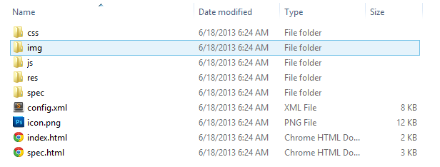
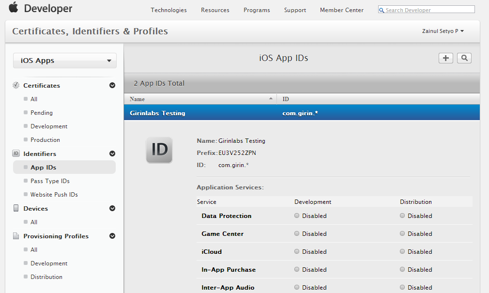

# Quick Start - Build Your First Application Using PhoneGap Build

In this section, we will show you how to create your first PhoneGap Build application.  From preparation, signing, and getting market ready application.

## Step 1 – Preparing Assets

Asset is your HTML5 application including HTML, JS, CSS, and image files. To make it easy, we have prepared starter HTML5 application. You can download or clone it at [https://github.com/justmyfreak/Phonegap-Build-Starter/](https://github.com/justmyfreak/Phonegap-Build-Starter). If you download it, you can extract it to edit source code.

You will find www folder contain many folders and files as the following :

There you go. We have our assets ready. If you notice, it just basic HTML5 application with addition of `config.xml`. Go explore on its source, change HTML file or images as you like. After you are done playing with HTML5 sources, we can step to the next step.

## Step 2 – Configure your Application

Configuring application is easy. Open `config.xml` in text editor you like, preferably Notepad++ or Sublime Text. We will change mandatory configuration as following : 

* Change application name

	Application name can be configured by editing <name> element. For this application let’s name our application Starter App. It can be done by changing `<name>` element from `<name>Hello World</name>` to `<name>Starter App</name>`

* Change application version

	Changing application version is easy. There is version attribute inside `<widget>` element. Let’s change our application version in to `1.1.0` .
	
* Change application id

	Application ID is unique identifier of application. It usually follow this rule : `com.vendor.appname` . Application ID can be edited by changing id attribute inside `<widget>` element. For Android and Blackberry, application ID can be anything as you want. But for iOS, it should be the same with registered Application ID registered in [https://developer.apple.com/account/ios/identifiers/bundle/bundleList.action](https://developer.apple.com/account/ios/identifiers/bundle/bundleList.action). Bellow is example of application ID :
	
	
If you are using wildcard application ID like me, you can just use `com.vendor.*`. For this application, let’s use `com.vendor.starterapp`

* Change application description

	Application description describe about details of your application. It will be displayed inside your PhoneGap Build account. To change your application description, you can edit `<description>` element as you like.

* Change PhoneGap version

	Changing PhoneGap version is required to make your application up to date with latest version of PhoneGap and its benefit. You can edit it in value attribute of `<preference>` element with phonegap-version name attribute. Before changing your PhoneGap version, make sure it is supported by checking it at [https://build.phonegap.com/docs/config-xml](https://build.phonegap.com/docs/config-xml).

	
## Step 3 – Upload and deploy App

* Zip your application

	After finishing preparing application’s assets and its configuration,  we just need to archive it into `.zip` file. Make sure you archive from root level of application. If you are using Windows and have Winrar or similar programs, all you need to do is just select all files and folders and then right click and choose Add to archive.

* Create new application

In this application, we will be using .zip deployment instead of Git. To create new application, simply log in to your PhoneGap Build account. Then choose new app.


Hit `Upload a .zip file` button. Select our `.zip` archive we have created earlier. 


It will take a while for uploading your archive. After upload completed, click `Ready to build` button then PhoneGap Build will do its magic to compile your application. This process take some times depending on server queue, so be patient. 


If you notice, everything is built successfully except for iOS. This is normal, so calm down. You have to unlock your sign key to build for iOS. This will be covered in next step.

* Unlock sign key and build

As mentioned earlier, we have to unlock sign key to build application for iOS. iOS need to sign application whether it used for development or production. If you are using development certificate and profile, you will be able to install your application in selected device or jailbroken devices. To distribute your application through Apple App Store, you need to use production certificate and profile.

Android and Blackberry require no sign key to be able to build application. But you will need to unlock your sign key to be able distributing application through Android Play Store and Blackberry App World. 

We have added our sign keys in chapter 2. So all we need to do is just unlock its password. To do this, you just need to click on dropdown list for platform you want to unlock sign key for. 


You will see there are locked sign key(s), then choose it. You will see lock icon on right of dropdown list. Click it and insert your password. Right after submitting password, it will rebuild automatically. But if it is not rebuild or having error, you can rebuild manual by clicking `Rebuild` button. Now, you have your application ready for distribution. 


* Download application

Now you have all of your application ready to download. All of your applications are ready for distribution to each platform corresponding digital market. Now you can relax and submit your application to market. Be prepared for next great features of PhoneGap Build
