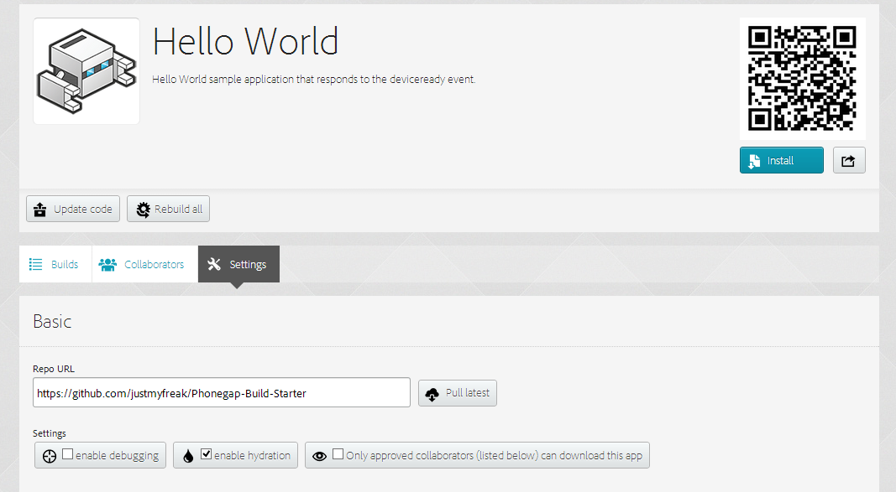

# Top Features You'll Want to Know About

As you start to use PhoneGap Build, you will realize that there are a wide variety of things that you can do with it. This section will teach you all about the most commonly performed tasks and most commonly used features in PhoneGap Build. 

## 1 – Git Deployment

We have talked about Git deployment in previous chapter. It is an alternative way to upload your HTML5 assets other than uploading .zip archive of your application. This is your only way to deploy open source application on PhoneGap Build. We have already knows that free account only allow us to have one private application and unlimited open source application. 

By using Git as our deployment method, we get benefit in speed of uploading source code as well as source code management. Source code can be pushed to your GitHub account then latter be pulled in your PhoneGap Build application. If you are not familiar with Git and GitHub, take a look at [http://try.github.io](http://try.github.io) for interactive tutorial. Trust me, it is worth to try and learn.

Let’s create application using GitHub repositories. Go to your account and click `new app`. Instead of choosing `private`, let’s create open source application. Click on `open-source` tab and text field will be shown.


If you have linked your PhoneGap Build account with your GitHub account, you will see that all your open source repos are available. If you cloned my [https://github.com/justmyfreak/Phonegap-Build-Starter](https://github.com/justmyfreak/Phonegap-Build-Starter) repos, you can select it. Otherwise, just paste `https://github.com/justmyfreak/Phonegap-Build-Starter` in your text box and PhoneGap Build will automatically fetch your source code.


After PhoneGap Build done fetching your source code, your application configuration will be fetched from `config.xml` and displayed. You may review it first. If everything is okay, just hit `Ready to build`. Once again, PhoneGap Build will do its magic to build you application. It takes some times to build your application. 


Once your application has been build successfully, you can download it and publish it. If you want to update your source code, simply commit change and push to your GitHub repository. Then you can pull latest changes by clicking Update code in your application dashboard.


If you notice, there will be share icon next to install button. Since we are creating open source application, we have a nice landing page for sharing your application to others without submitting to each market. It looks like the following :


## 2 – Collaboration Development

Another nice thing about PhoneGap Build is collaboration in development. Collaboration not only can be done in writing application, but also in testing application. It will help us when working with others from different place. 

There are two types of collaborators, they are Tester and Developer. Tester can only download compiled application, while developer can update source code. Collaboration development can be used in both open source and private application.

To add collaborators, simply click on collaborators tab in your application dashboard. Then you can add collaborator’s email address and its role as tester or developer. Collaborator will be notified by email. 


## 3 – Native Plugins
Plugins are used to extend your application to have native capabilities. Plugins need to be implemented differently for each platform. Plugins may not be supported in certain platform. Not all PhoneGap plugins can be used in PhoneGap Build. List of supported plugins can be viewed on [https://build.phonegap.com/plugins](https://build.phonegap.com/plugins). 


Plugins can be added to your project by using 2 steps : 

1. Importing the native code using the config.xml

2. Referencing the JavaScript code for the pluginReferencing the JavaScript code for the plugin


### 1 - Importing the native code using the `config.xml`
Importing native code can be done by adding `<gap:plugin>` to your `config.xml`. For example : 

	<gap:plugin name="com.phonegap.plugins.example" version="2.2.1" />

For plugins versioning, you can use the tilde `~` such as : 

	<gap:plugin name="com.phonegap.plugins.example" version="~2" />
it will load the latest 2.x version.
	
	<gap:plugin name="com.phonegap.plugins.example" version="~2.3" />
	
it will load the latest 2.x version as long as the x is greater or equal to 2

	<gap:plugin name="com.phonegap.plugins.example" version="~2.3.4" />
	
it will load the latest 2.3.x version as long as the x is greater or equal to 4.

#### Plugin Parameters
Some plugins may require additional information to work. This can be done by adding some childern to `<gap:plugin>` like this : 

	<gap:plugin name="com.phonegap.plugins.someplugin">
	  <param name="APIKey" value="myapikey" />
	  <param name="APISecret" value="myapikeyscret" />
	</gap:plugin>
	
#### Example : 
Here is an example to add Local Notification to your project : 

	<?xml version="1.0" encoding="UTF-8" ?>
	    <widget xmlns   = "http://www.w3.org/ns/widgets"
	    xmlns:gap   = "http://phonegap.com/ns/1.0"
	    id          = "com.phonegap.example"
	    versionCode = "10" 
	    version     = "1.0.0" >
	
	    <!-- versionCode is optional and Android only -->
	
	    <name>PhoneGap Example With Local Notification</name>
	
	    <description>
	      Your awesome application description 
	    </description>
	
	    <author href="https://build.phonegap.com" email="mail@domain.com">
	      Your Name 
	    </author>
	
	    <!-- We'll include the Local Notification plugin as an example -->
	    <gap:plugin name="de.appplant.cordova.plugin.local-notification" />
	</widget>

### 2 - Referencing the JavaScript code
Some plugins utilize the `js-module` element to make cordova load the plugin javascript. Then, no `
	
	
Whether the `script` tag is required or not, you **must not** add actual javascript files of plugin to your repository or your build will fail. These files will be injected automatically by PhoneGap Build. 


## 4 – Hydration

Hydration is a tool that has two main benefits for both developers and testers. Improving compilation times and enabling updates pushed directly to application installed on a device. This feature allows us to make instant update without submitting new binary to market. This is very handy for publishing iOS application. Since Apple’s review process takes some days to get approved and published to their App Store.

PhoneGap accomplishes this by compiling native binary that acts as container for your mobile application. Once developer uploads a new build, the end user (eg. tester) of the application will be notified upon restart of application. If user decides to run your latest code update, the new code will be automatically fetched and installed in end user device.

To be able to use hydration, you have to configure your application to enable hydration. Remember our last open source application using [https://github.com/justmyfreak/Phonegap-Build-Starter](https://github.com/justmyfreak/Phonegap-Build-Starter) as source code? let’s add hydration to it. This can be done by clicking settings tab inside your application dashboard. Then check `enable hydration` and save. Your application will be rebuilt


Let’s make update to our source code repository by committing change to GitHub. If you want edit your own source code, you may fork my  [https://github.com/justmyfreak/Phonegap-Build-Starter](https://github.com/justmyfreak/Phonegap-Build-Starter) repo and create new application using your own repo url.

After making changes to your application, be sure to pull latest code by clicking update code and Pull latest. You will see Hydration (pending) which means your code will not be sent to device. After Hydration (complete) changes will be sent to device and user will be prompted to update code.


When using hydration, you may **not** change configuration including name, version, version code, icons, splash screen, preferences, features, and access tags. If you change configuration, PhoneGap Build will generate new binary of your application instead of using hydration.

To disable your hydration simply go to application’s setting tab and uncheck enable hydration. Don’t forget to hit save button.
